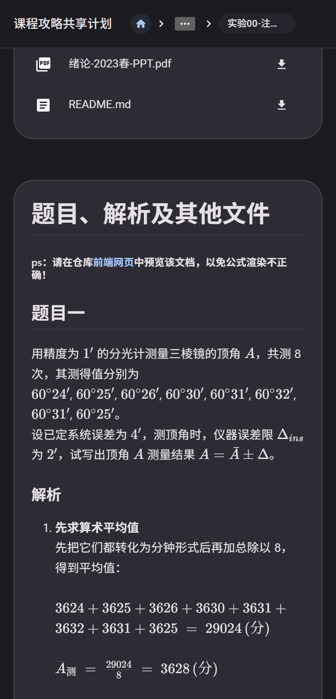
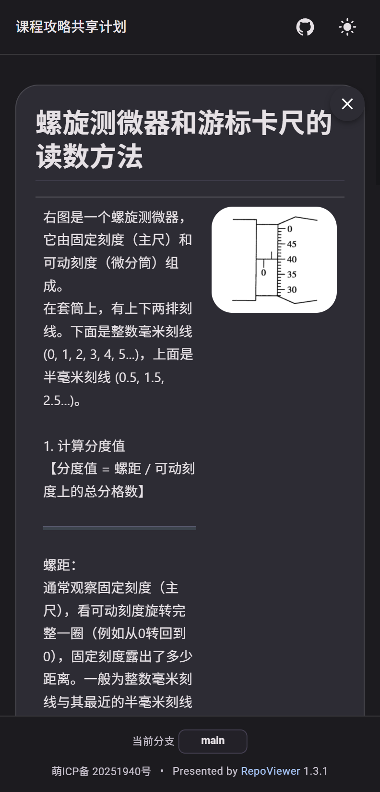
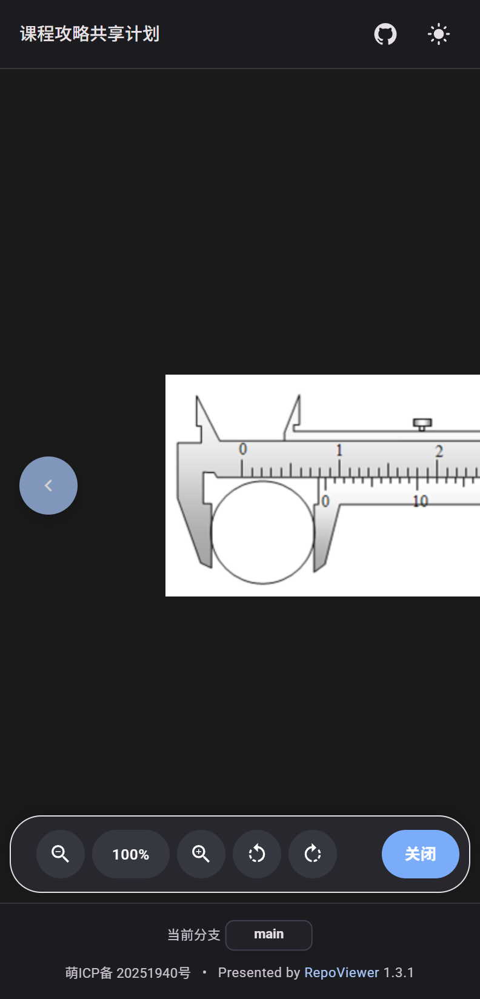

  <h1><em>Repo-Viewer</em></h1>

  

    <strong>基于 Material Design 3设计风格的 GitHub仓库浏览应用</strong>
    &nbsp;&nbsp;
    
  

<table>
  <tr>
    <td></td>
    <td></td>
    <td></td>
  <tr>
</table>

## 主要功能

- 📁 **仓库浏览**：直观的文件结构导航，同时提供首页文件和文件夹排除选项.
- 🔎 **文件搜索**：支持基于自建索引和 Github API 的快速文件搜索，可按分支、路径前缀和扩展名过滤.
- 📄 **文件预览**：多种文件格式预览，目前支持 `Markdown`、 `PDF` 和 `图片`.
- ⬇️ **文件下载**：可下载单个文件或整个文件夹.
- 🌐 **SEO优化**：提高搜索引擎可见性.

## 部署指南

### 环境变量配置

详见 [.env.example](.env.example)。其中包括必须配置的变量，以及可忽略的变量。

### 使用Vercel部署

1. **在GitHub上创建个人访问令牌（PAT）**:
   - 访问 [GitHub设置 → 开发者设置 → 个人访问令牌](https://github.com/settings/tokens)
   - 创建一个或多个具有 `repo` 权限的令牌
   - 保存这些令牌，你将在下一步中使用它们

2. **在Vercel上导入你的仓库**:
   - 登录 [Vercel](https://vercel.com)
   - 点击 `Import Project`
   - 选择 `Import Git Repository` 并连接你的GitHub账号
   - 选择Repo-Viewer仓库

3. **配置环境变量**:
   - 在部署设置页面，找到 `Environment Variables` 部分
   - 添加必要的环境变量

4. **部署应用**:
   - 点击 `Deploy` 按钮
   - Vercel 将自动构建和部署你的应用

### RV-Index 索引

> 此功能由 [docfind](https://github.com/microsoft/docfind) 提供支持

Repo-Viewer 使用 docfind 生成静态索引并随站点发布。构建时运行 `scripts/generateDocfindIndex`，产物位于 `public/search-index/`：

- `public/search-index/manifest.json`
- `public/search-index/<branch>/docfind.js`
- `public/search-index/<branch>/docfind_bg.wasm`

## 许可证

> 本项目使用 **AGPL-3.0** 许可证。完整条款见 [[LICENSE](LICENSE)]

- ✅ 可以自由使用、修改和分发
- ⚠️ 必须开源修改后的代码并保留原作者版权信息
- ⚠️ 修改后的版本必须使用相同的 AGPL-3.0 许可证
- ⚠️ 网络部署也需要开源

## 贡献者

## Stars

